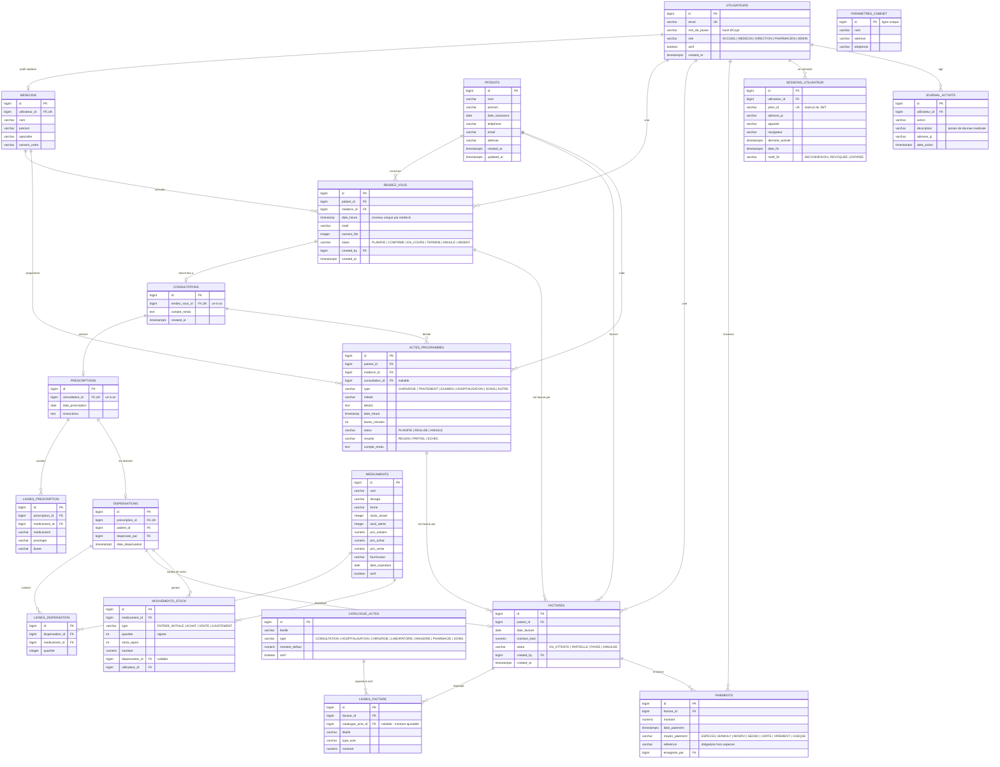

# Schéma de la base de données — Cabinet Médical

Base PostgreSQL `cabinet_medical`, schéma versionné par **Flyway** (`backend/src/main/resources/db/migration`).

| Migration | Contenu |
|---|---|
| `V1__init.sql` | Schéma du cœur métier : 11 tables, contraintes `CHECK` sur les statuts, index `idx_patients_nom_prenom` et `idx_rendez_vous_medecin_date` |
| `V2__seed_data.sql` | Comptes de démonstration (3 rôles) + 1 médecin |
| `V3__fix_test_account_passwords.sql` | Correction du mot de passe de démonstration (sans réécrire V2) |
| `V4__demo_data.sql` | Jeu de données de démonstration complet : catalogue d'actes, 3 médecins, 8 patients, 14 rendez-vous, 5 consultations, 4 prescriptions, 9 factures, paiements et statuts cohérents |
| `V5__pharmacie.sql` | Catalogue initial de médicaments, stock, tables de dispensation liées aux prescriptions |
| `V6__pharmacien_role.sql` | Ajout du rôle PHARMACIEN et du compte de démonstration |
| `V7__link_prescriptions_to_medicaments.sql` | Référencement des lignes de prescription vers le stock |
| `V8__fix_pharmacien_demo_password.sql` | Correction du mot de passe de démonstration du pharmacien |
| `V9__pharmacy_commercial_fields.sql` | Prix achat/vente, fournisseur et date d'expiration des médicaments |
| `V10__appointment_queue_number.sql` | Numéro de file quotidien pour les reçus de rendez-vous |

## Diagramme entité-association



## Règles de gestion portées par le schéma

- **Un rendez-vous = un créneau médecin** : chaque rendez-vous et chaque acte programmé occupe `[date_heure, date_heure + duree_minutes[` ; `DisponibiliteService` refuse (409) tout chevauchement avec un rendez-vous non annulé / non absent ou un acte planifié du même médecin.
- **Facture reliée à son origine** : `factures.rendez_vous_id`, `factures.acte_programme_id` ou `dispensations.facture_id` ; une seule facture non annulée par rendez-vous ou par acte. Un rendez-vous ou un acte facturé ne peut être annulé qu'après annulation de sa facture.
- **Stock tracé** : tout changement de `medicaments.stock_actuel` (stock initial, achat, vente, correction d'inventaire) crée une ligne `mouvements_stock` avec le stock résultant et la valeur.
- **Sessions** : le JWT porte l'identifiant de session (`jti`) ; une session fermée (déconnexion, révocation par l'administrateur, compte désactivé) invalide son jeton.
- **Un rendez-vous honoré donne au plus une consultation** : `consultations.rendez_vous_id` est `UNIQUE` ; la création clôture le rendez-vous (`TERMINE`).
- **Une consultation porte au plus une ordonnance** : `prescriptions.consultation_id` est `UNIQUE`.
- **Une facture regroupe plusieurs actes** : relation un-à-plusieurs `factures → lignes_facture` ; chaque ligne porte `libelle`, `type_acte` et `montant` (le type d'acte couvre consultation, hospitalisation, acte chirurgical, etc.).
- **Les paiements sont séparés de la facture** : relation un-à-plusieurs `factures → paiements`, ce qui autorise les règlements partiels ; le statut (`EN_ATTENTE`, `PARTIELLE`, `PAYEE`) est recalculé côté serveur à chaque encaissement.
- **Tracabilité** : `rendez_vous.created_by`, `factures.created_by` et `paiements.enregistre_par` référencent `utilisateurs` (qui a fait quoi).
- **Pharmacie** : une prescription ne peut être dispensée qu'une fois ; chaque ligne vérifie le stock disponible puis le décrémente dans la même transaction. Les médicaments sous le seuil d'alerte sont signalés dans l'interface.
- **Extensions restantes sans refonte** : laboratoire (`examens` rattachés à `consultations`) et bloc opératoire (`interventions` rattachées à `patients`/`medecins`).

## Export du schéma

Pour régénérer le schéma depuis PostgreSQL :

```powershell
pg_dump --schema-only --no-owner --dbname=cabinet_medical > schema.sql
```